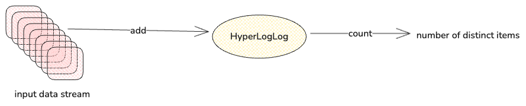
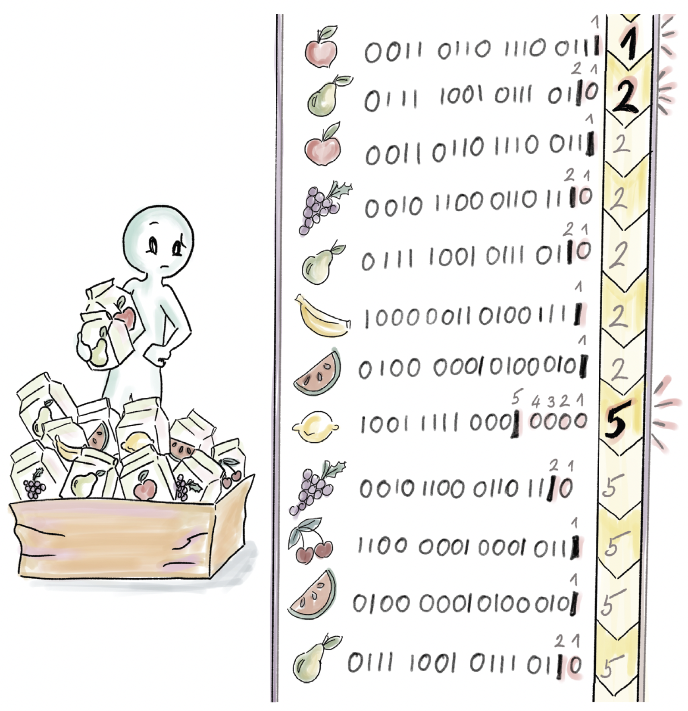
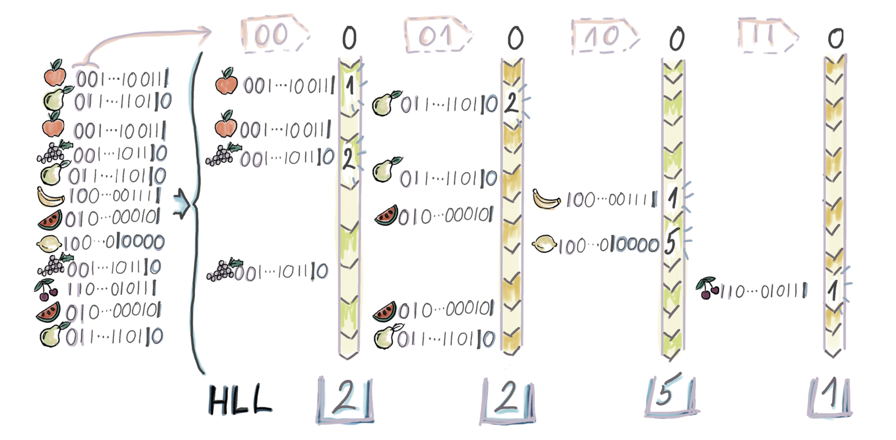
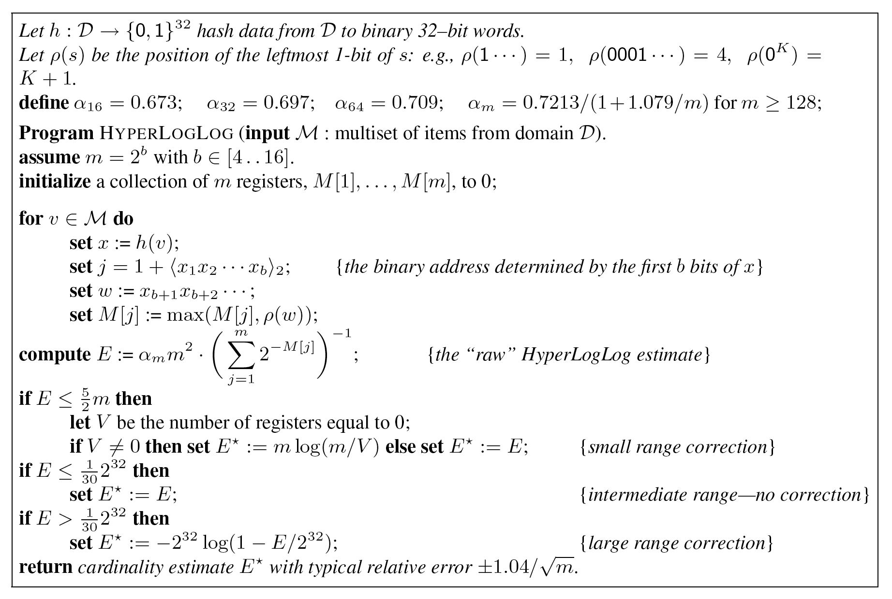
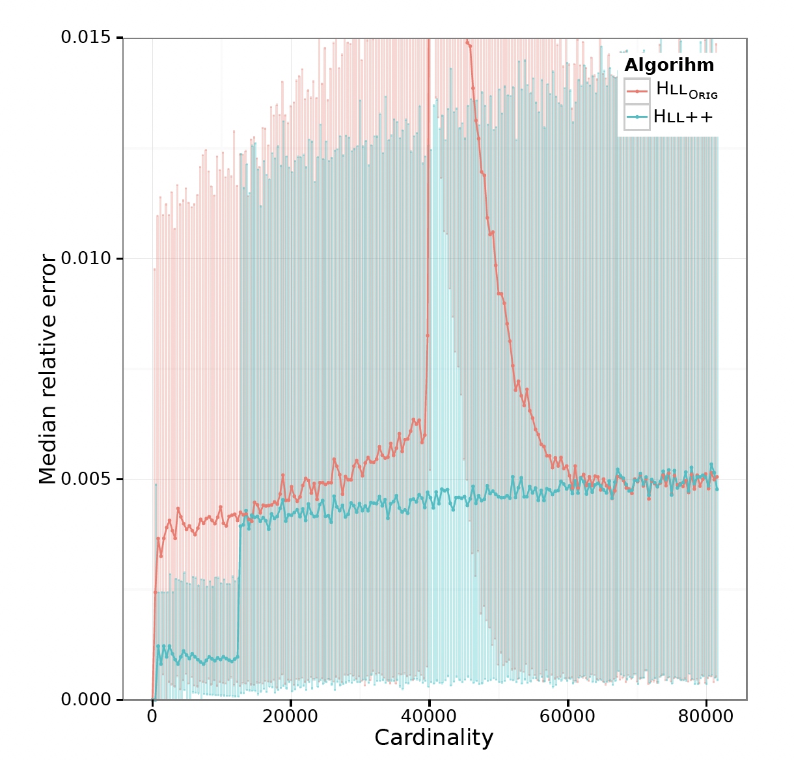

Note: the current template may not render LaTeX math equations correctly. You may checkout the original markdown file and use your own markdown reader to read this article. I'm sorry for that and I will fix this as soon as possible.


# 如何从统计网页UV？

我们可以用下面的SQL语句来计算：

```sql
  SELECT COUNT(DISTINCT user_ip_address)
  FROM daily_visits 
  WHERE product_id = 1234
```

可是当数据量上十亿怎么办？

我们的问题定义如下：在一个允许元素重复的Multiset中找到不同的元素的个数，这样的个数成为基数，即Cardinality。

当基数的数量级大到一定程度，我们可以选择牺牲一定程度的精确性，从而更快地计算其估计值。例如：SQL Server 2019提供了*APPROXCOUNT_DISTINCT*操作，其仅仅需要少量的空间并且计算很快；Google BigQuery更进一步，将这种概率估计的方案作为默认，即*COUNT_DISTINCT*，保留*EXACT_COUNT_DISTINCT*用于计算精确值。

而这些估计方法的背后，就是我们今天的主角: **HyperLogLog**!

# 什么是HyperLogLog



如果所示，HyperLogLog是一个数据结构，将数据流添加到HyperLogLog中，Count返回数据流中不同对象的个数的估计值。其误差极小，占用空间极小，通常十几KB。

那么HyperLogLog究竟是用了什么魔法来实现这么惊人的效果？

### 第一步尝试

一种粗糙的估计，称为概率计数(probabilistic counting)。记号$h_i$表示对集合M中的第i个元素的hash，其值为L位的完全由0或者1构成的数。记

$$\rho_i = (the\:number\:of\:trailing\:zeros\:of\:h_i) + 1$$

例如：$h_1 = 100$, $h_2 = 0111$, $h_3 = 0000$，那么$\rho_1 = 3$ $\rho_2 = 1$, $\rho_3 = 5$。

那么我们的个数估计为：$E = 2 ^ {\rho_{max}}$.

这里的核心思想为：考虑一个均匀随机生成的k bits的字符串，其

$\rho = 1$的概率是1/2; 
    
$\rho = 2$的概率是1/4;

$\rho = i$ 的概率是$1/2^i$. 

在均匀随机的情况下，一件事发生的概率为$1/2^i$，其平均需要重复$2^i$次才会出现。也就是说，当我们有一个元素使得$\rho_i = \rho_{max}$，平均来说就意味着集合中不同的元素有$2^{\rho_{max}}$个。



如果所示，注意到柠檬对应的hash为1001 1111 0001 0000的$\rho_{max} = 5$，因此我们得到$E = 2^5 = 32$

### 更进一步

显然，这个方法得到的结果一定是一个2的幂，我们如何改进呢？

我们采取一个称为\textit{stochastic averaging}的方法的，即将所有元素的hash值拆分成$m = 2^b$个子集。具体的操作时，对于$h_i$，我们看其前b个bits的十进制数作为其应该放入的桶的index。例如，假设$h_i$为**0010 0001** ... 1010, $b = 8$，那么我们可以将其放第0010 0001个桶，也就是第33个桶。

这种方式其实是不使用多个hash函数的一种妥协，现实情况中，要对每个值计算m次hash的代价是不可接受的。

现在我们有了m个估计值，我们简单计算其算数平均数:

$$A = \frac{\sum_{i=1}^{m}\rho_{i,max}}{m}$$

我们用这个值来估计一个桶基数，则有：$E_{bucket} = 2^A$. 那么总的基数为

$$ E = m \times E_{bucket} = m \times 2 ^ {\frac{\sum_{i=1}^{m}\rho_{i,max}}{m}}. $$


回到我们的例子：


如果所示，在我们的例子中，$b=2$, $m=4$，每个桶的$\rho_{max}$分别为2，2，5，1，因此$A = (2 + 2 + 5 + 1)/ 4 = 2.5$，$E_{bucket} = 2^{2.5} \approx 5.66$, $E = m * E_{bucket} = 4 ^ 5.66 = 22.64$。已经比32更加靠近实际的值7了！

### LogLog

LogLog算法引入一个修正因子来规范化上面的结果：

$$E = \widetilde{a}_m \times m \times 2 ^ {\frac{\sum_{i=1}^{m}\rho_{i,max}}{m}},$$

其中$\widetilde{a}_m \sim 0.39701 - \frac{2\pi^2 + (\mathrm{ln}2)^2}{48m}$, 对于实际情况，即$ m > 64$，我们可以简单取$\widetilde{a}_m = 0.39701$。

应用到我们的例子中，$\widetilde{a}_m \approx 0.292$, 因此$0.292 \times 22.6 = 6.6$。

经过数学上的统计分析，LogLog的相对误差约等于$1.3/\sqrt {m}$。基于此，通常的实现中取$m = 2^{14}$，相对误差为$1.3/\sqrt{2^{14}} = 1.01\%$，该值和数据集大小无关!

对于空间占用，$2^{14}$个8字节的整数所需的存储空间仅为130KB。

相当神奇！


# HyperLogLog

在介绍HyperLogLog之前，我们回顾一下毕达哥拉斯平均数。

- **算数平均** $$AM = \frac{x_1 + x_2 + ... + x_n}{n};$$
- **几何平均** $$GM = \sqrt[n]{\vert x_1 \times x_2 \times ... \times x_n\vert};$$
- **调和平均** $$HM = \frac{n}{\frac{1}{x_1} + \frac{1}{x_2} + ... + \frac{1}{x_n}}.$$

HyperLogLog和LogLog的不同在于，LogLog采用算数平均来计算$E_{bucket}$，HyperLogLog则采用调和平均来计算：

$$ E_{bucket} = \frac{m}{\sum_{i=1}^{m} 2 ^{-\rho_{i,max}}}$$

最终结果为
  
$$ E = \alpha_m \times m \times E_{bucket} = \frac{a_{m}m^2} {\sum_{i=1}^{m} 2 ^{-\rho_{i,max}}}$$

其中

$$ \alpha_m = \left(m \int_{0}^{\infty} \left(\mathrm{log}_{2} \left(\frac{2 + u}{1 + u}\right)\right)^{m}\mathrm{d}u\right)^{-1}$$

对于$m > 128$，可以取$\alpha_m = 0.723 / (1 + 1.079/m)$.

回忆四个桶的$\rho_{max}$分别问2，2，5，1，因此
  
$$ E_{bucket} = \frac{4} {\left(\frac{1}{2}\right)^2 + 
  \left(\frac{1}{2}\right)^2  + \left(\frac{1}{2}\right)^5 + 
  \left(\frac{1}{2}\right)^1} = \frac{4}{\frac{33}{32}} \approx 3.88 $$

因为$\alpha_4 = 0.541$，最终结果为$E = 0.541 \times 4 \times 3.88  = 8.39$。

虽然对这个例子来说，其结果不如LogLog，但是当数据量大起来之后，HyperLogLog能够有更好的相对误差: $1.04/\sqrt{m}$（LogLog的分子是1.3）。


至此，我们已经得到了HyperLogLog的朴素估计值。我们来从直觉上分析一下其正确性。

设$n$是基数，那么每个桶的个数近似$n/m$个，而$\rho_{max}$则接近$\mathrm{log}_2 \left(n/m\right)$。调和平均$E_{bucket}$的数量级为$n/m$，因此$m\times E_{bucket}$的数量级$n$。而我们引入的常数$\alpha_m$则用来修正系统误差。


## 为什么叫HyperLogLog？

还有一个问题，HyperLogLog这个名字来源于LogLog，那LogLog这个名字的来源是？

假设我们的基数最大值为$k_{max}$，那么我们需要$O(\mathrm{log}_2 k_{max})$长度的hash就足以区分。因此我们需要$O(m\mathrm{log}_2 \mathrm{log}_2 k_{max})$个bits来存储这些桶里的最大值。

这就是LogLog的名字的由来。

# 实践

2007年Philippe Flajolet发表了《HyperLogLog: the analysis of a near-optimal cardinality estimation algorithm》.

### 对小杯的修正

当基数n相对m较小的时候，m个寄存器中有很多的都是0；尤其是当n=0的时候，朴素估计值$E = \alpha_m \times m \approx 0.7m$. 因此对于小杯数据的修正是必要的。

我们思考一下：把n个篮球随机扔向m个篮筐，空的篮筐的个数期望是多少？

设$X_i = 1$表示第i个篮筐为空，

$$E\left(\sum_{i=1}^{m} X_{i} = 1\right) = \sum_{i=1}^{m} E\left(X_{i} = 1\right) 
  = m \left(1 - \frac{1}{m}\right)^{n}$$

当$n/m \rightarrow 0$，期望约等于$m\times e^{-\frac{n}{m}}$，注意这里的E是期望，不是HLL的估计值。

设$V$表示buckets中空桶的数量，于是当$n < 2.5m$时，HLL给出的估计值为$E = m\mathrm{log}\frac{m}{V},$


### 对大杯的改进

原本的HLL采用32位hash，因此当n接近$2^32$次方的时候，hash冲撞就已经很可能发生了。此时HLL的朴素估计值基本上相当于不同的hash值的数量。
即$E = 2^{L} - 2^{L}e^{-\frac{n}{2^{L}}}$, 当$n > \frac{2^{32}}{30}$时，HLL的估计值修正为$n = -2^{32}\mathrm{log}\left(1 - \frac{E}{2^{32}}\right)$.


### HyperLogLog算法



## 谷歌的改进

2013年谷歌发表了《HyperLogLog in Practice: Algorithmic Engineering of a State of The Art Cardinality Estimation Algorithm》, 提出了HyperLogLog++算法，对原来的HyperLogLog在n值较小的范围进行了很多优化。

首先是将32位hash改成了64位hash，这样我们就不需要对大杯进行修正了。

然后是引入稀疏格式：当$n \ll m$时，绝大多数的桶都是空的。

- 将$\langle idx, \rho \rangle$的pairs拼成一个sorted list。这样只需要存储有值的元素;
- 如果稀疏格式占用的空间比稠密格式占用更大，则切换到稠密格式；
- 为了防止频繁的插入，引入一个临时的set缓存更新，等到缓存足够大的时候再统一merge进sorted list；
- 引入稀疏格式后，我们还能够适当的增大用于idx的bit数，以此来提高精度。



## Redis的实现

2014年四月，Redis在此基础上实现了HyperLogLog算法。HLL的提出者Philippe Flajolet在2011年已经去世。为了纪念HLL的提出者Philippe Flajolet，Redis的HLL的命令均以"pf"开头。

### Redis对HLL做了哪些优化？

- 浮点数计算$2^{-\rho}$改成预先计算并查表获取；
- 缓存上一次的结果，检测到桶数据有变化的时候才重新计算。

## 我的实践

我按照原论文中的描述[实现了HyperLogLog算法](https://github.com/patrhez/hyperloglog)（只做了简单改动）：，欢迎Review。

程序生成了100万个字符串作为输入，并控制重复的字符串在1万个左右，结果如下：

|           | count  | error     |
|-----------|--------|-----------|
| My HLL    | 987141 | 0.2860\%  |
| Redis HLL | 979807 | 1.0194\% |


# References

- D. Medjedovic, E. Tahirovic, and I. Dedovic. Algorithms and Data Structures for Massive Datasets. Manning, 2022.

- Philippe Flajolet, Éric Fusy, Olivier Gandouet, and Frédéric Meunier. Hyperloglog: the analysis of a near-optimal cardinality estimation algorithm. Discrete mathematics & theoretical computer science, (Proceedings), 2007.

- Stefan Heule, Marc Nunkesser, and Alexander Hall. Hyperloglog in practice: Algorithmic engineering of a state of the art cardinality estimation algorithm. In Proceedings of the 16th International Conference on Extending Database Technology, pages 683–692, 2013.

- Redis new data structure: the hyperloglog. http://antirez.com/news/75.