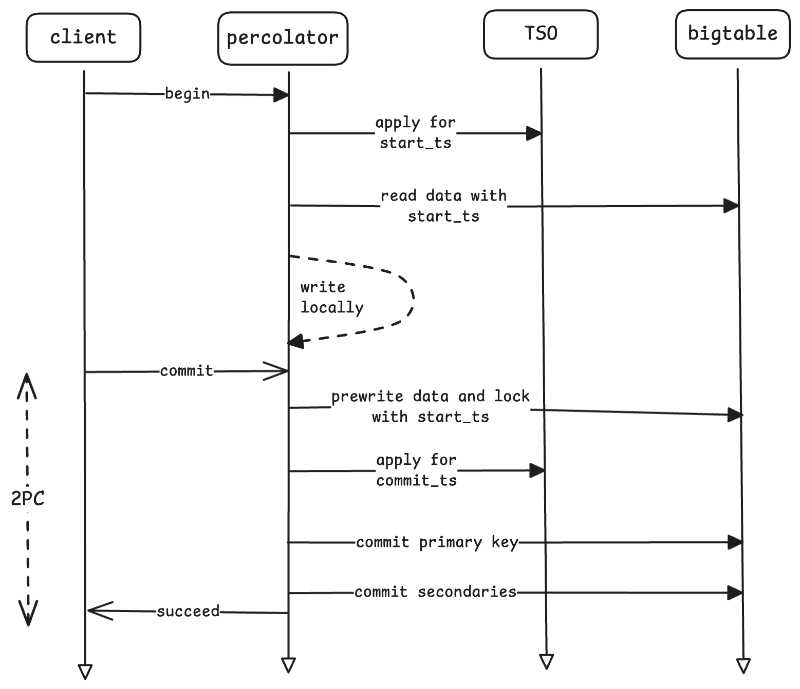
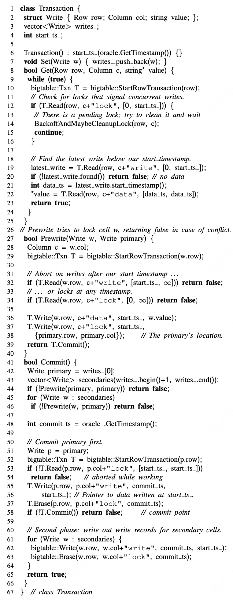

# 摘要

前段时间在看TiDB论文的时候了解到了TiDB的事务模型是受[Percolator](https://research.google/pubs/large-scale-incremental-processing-using-distributed-transactions-and-notifications/)启发而来的。Percolator是Google为了提高对其爬去的网页数据更新索引而开发的一个增量处理系统。Percolator比较令人关注的一点是，其基于Bigtable的单行事务，提出了一个修改版的2PC模型，使其支持多行事务以及分布式事务。本文将简单总结其分布式事务的原理。

# Bigtable简介

[Bigtable](https://research.google/pubs/bigtable-a-distributed-storage-system-for-structured-data/)是Google早期的一个多版本的分布式K/V数据库，在存储上采用LSM-Tree的架构，其数据模型如下所示：

$$\left(row:string,\;column:string,\;time:int64\right) \rightarrow string.$$

Bigtable不支持ACID事务，仅仅支持单行事务。

# Percolator事务模型

Percolator在bigtable的基础上，通过客户端library的形式实现ACID事务，这一点不同于其他的分布式数据库服务，因此其在管理锁的方式上较为特别。Percolator实现了snapshot isolation事务隔离级别，该级别弱于serializability，可能存在write skew问题，但其优点在于性能更高。由于数据是多版本，对于读取某个特定版本/时间戳的数据时，无需加锁。

Percolator的锁是直接存储在Bigtable中，通过特点的列来管理事务的状态，如下图所示：

| Column  | Use                                                                                     |
|---------|-----------------------------------------------------------------------------------------|
| c:lock  | All uncommitted transaction is writing this cell; contains the location of primary lock |
| c:write | Committed data present; stores the Bigtable  timestamp of the data                      |
| c:data  | Stores the data itself                                                                  |

当然，Percolator中还有其他的列用于增量处理，本文省去这部分。这里的"c"指的是某个列的名字；其中"primary lock"后文会解释。

我们拿论文中的例子来看：

| key | bal:data      | bal:lock  | bal:write        |
|-----|---------------|-----------|------------------|
| Bob | 6:  5: $10 | 6:  5: | 6: data@5  5: |
| Joe | 6:  5: $2  | 6:  5: | 6: data@5  5: |

Percolator中的数据是多版本的，同一个key的不同版本通过一个时间戳来区别，例如上图中，Bob的账户中，"$10"(10美元)这个版本的数据时在时间戳timestamp=6时commit的。可以看到，bal:write列中存储了提交数据的位置（即timestamp=5处）。

在Percolator中有一个叫做Timestamp Oracle（简称TSO）的中心化节点来分配严格单调递增的时间戳，以此来解决分布式系统中时钟漂移的问题。

## 写流程

事务的提交过程如下图所示：

事务的开始时从TSO获取一个事务开始的时间戳start_ts，此后事务只能读到commit_ts小于start_ts的数据。同许多分布式事务的做法一样，写操作是缓存在客户端的，因此这部分数据不会被其他事务看见。

事务的提交分成两个阶段，Prewrite阶段和Commit阶段。

在Prewrite阶段：

1. 在事务涉及到的众多key中，选择一个作为primary，其他的则称为secondaryes；
2. 对primary行，写入时间戳为start_ts的lock列以及修改后的data列；
3. 对于每一个secondary，同样写入时间戳为start_ts的locklock列和data列，与primary不同的是，lock将会存储primary的位置，以便其他事务能够根据lock找到primary的位置，并根据primary判断事务的状态。

在Commit阶段，

1. 获取一个新的时间戳commit_ts，删除primary的lock，写入primary的write列，write列会存储数据所在的时间戳，以便根据write列找到提交的数据；
2. 对剩下的secondaries执行同样的操作：替换lock列为write列。

当Commit中，primary的数据通过bigtable的单行事务提交之后，事务就必须commit了，理论上此时Percolator已经可以告诉用户事务提交成功了，至于剩下的secondaries的锁没有清理其实也没有关系，Percolator在别的事务读取数据时会进行roll forward帮助其清理。

需要注意的是，在prewrite中，如果检测到某行已经有在start_ts之后的write记录了，或者该行已经被加任意时间戳的锁了，则会abort当前事务。

回到我们的例子中，假设现在有个事务想要从Bob的账户中转账7美元给Joe的账户。我们来看下事务是如何完成的。

| key | bal:data              | bal:lock                      | bal:write             |
|-----|-----------------------|-------------------------------|-----------------------|
| Bob | 7: $3 6: 5: $10 | 7: primary 6: 5:        | 7: 6: data@5 5: |
| Joe | 7: $9 6: 5: $2  | 7:primary@Bob.bal 6: 5: | 7: 6: data@5 5: |

如上图所示，事务首先获取一个start_ts，即7，在prewrite阶段，选取Bob为primary row，在Bob的行上写入了计算后的data（10-7=3美元）和lock，lock中标记自己是primary；同样地，Joe作为secondary row，在prewrite中写入计算后的数据9美元以及在lock列中标记primary是在Bob的bal列中。

进入到Commit阶段，我们获取一个commit_ts=8，首先Commit primary row，即Bob：

| key | bal:data                  | bal:lock                      | bal:write                        |
|-----|---------------------------|-------------------------------|----------------------------------|
| Bob | 8: 7:$3 6: 5:$10 | 8: 7: 6: 5:          | 8:data@7 7: 6:data@5 5: |
| Joe | 7:$9 6: 5:$2        | 7:primary@Bob.bal 6: 5: | 7: 6:data@5 5:             |

可以看到，lock被替换成了commit_ts时间戳的write数据，write数据写入后，改事务的数据即可被其他事务所见。write列的内容是其commit的数据的位置，可以看到是在时间戳为7的位置，结果是3美元。

接着提交secondary，即Joe：

| key | bal:data                  | bal:lock             | bal:write                        |
|-----|---------------------------|----------------------|----------------------------------|
| Bob | 8: 7:$3 6: 5:$10 | 8: 7: 6: 5: | 8:data@7 7: 6:data@5 5: |
| Joe | 8: 7:$9 6: 5:$2  | 8: 7: 6: 5: | 8:data@7 7: 6:data@5 5: |

同样地，我们将lock替换成commit_ts的write，事务执行完成，最终，Bob还剩下3美元，而Joe还剩下9美元。

## 读操作

在理解了写操作的基础上，我们来看读操作的流程。
1. 首先开启一个bigtable的单行事务，检查在小于start_ts的时间内该行是否加锁，如果有，则说明其他的事务锁住了该行，此时我们无法判断先行事务的状态如何，因此我们选择backoff一段时间然后重试（在故障恢复小节我们会介绍其如何判断是否帮助先行事务进行roll forward）；
2. 如果没有锁，则读取start_ts前的最近的一次write，即last_write，若last_write不存在，则说明给该行数据没有可见的版本，返回无数据即可；否则从last_write中获取其存储的时间戳，该时间戳即为数据所在的版本，我们读取该版本的data列即获取到了数据。

应用到我们的例子中，
| key | bal:data                  | bal:lock             | bal:write                        |
|-----|---------------------------|----------------------|----------------------------------|
| Bob | 8: 7:$3 6: 5:$10 | 8: 7: 6: 5: | 8:data@7 7: 6:data@5 5: |
| Joe | 8: 7:$9 6: 5:$2  | 8: 7: 6: 5: | 8:data@7 7: 6:data@5 5: |

假设我们当前的时间戳为9，我们想要读取Bob的余额，我们首先看Bob是否有小于9的lock，由于并没有锁，我们获取小于9的最近的一次write，即版本为8的这一次，其中存储了数据是在版本7的bal:data列中，于是我们读到Bob的余额为3美元。

这里放下论文中提供的流程伪代码（percolator并未开源）：

## 故障恢复

前面提到了，Percolator中的事务是由客户端来coordinate的，那么客户端如果在执行事务的过程中挂了，其可能恢复也可能永远不会恢复，我们怎么处理这种情况呢？

客户端可能在事务执行到任意时候故障，Percolator为了应对这点，选取了其中的一个key/row作为primary，并以primary的commit作为整个事务的commit point，下面我们来看其中的奥妙。

我们可以把情况归结为两种

1. primary commit之前；
2. primary commit完成后。

当事务T1在读或者写的过程中发现某个行R1被更早的事务T0加锁了的时候，T1此时不会立即回滚自己，而是检查T0的primary lock：

- 如果primary lock已经消失了，但是有对应的write记录，则说明T0实际上已经commit了，此时R1残留的锁应该被清理，因此事务T1帮助T0清理剩下的锁，该过程即为上面提到的roll forward。清理完成后，T1可以继续执行（回顾读操作伪代码中的BackoffAndMaybeCleanupLock的MaybeCleanupLock部分）
- 如果primary lock消失并且没有留下write记录，则说明事务T0被abort了，那么R1的残留的锁也应该被清理。
- 如果primary lock存在但是锁太老了，也会滚T0事务。这里有个问题，如何判断事务是不是太老了呢？论文给出的解法是，通过让节点定时向[Chubby](https://research.google/pubs/the-chubby-lock-service-for-loosely-coupled-distributed-systems/)(Google内部的一个通过multi-paxos算法实现分布式锁服务)发送心跳确保存活并且如果是执行长事务，定期更新wall clock来标记锁的活性。
- 如果以上情况都不是，则事务T1需要backoff后重试或者会滚自己。

当事务提交之前，其会检查是否自己依旧拥有锁；当事务清理别的事务的锁时，也会检查对方的primary是否提交。而primary的提交是通过bigtable的单行事务来完成的，因此安全性得到保障。

# Timestamp Oracle

上面介绍了Percolator的事务模型，其实主要是并发控制技术和提交技术。其中关键的两个步骤，分别是获取事务的开始时间戳和提交时间戳。我们知道，分布式环境中，物理时钟是不可靠的，不同节点之间的时钟可能不同步，同一个节点的时钟也会发生时钟漂移。时钟不可靠的一个直接的结果就是，物理上后发生的一个事务，获取到了一个比物理上发生更早的事务还要小的时间戳，导致后发生的事务操作错误的数据，从而破坏了因果关系，导致数据的错误。

Percolator的解法是Timestamp Oracle，即一个中心化的时间戳服务提供混合时间戳（物理+逻辑）。简单来说，就是TSO定期批量分配一个时间戳的范围，，并且将该范围的上界存储到可靠的存储中（例如etcd，通过Raft协议保证数据的线性一致性）。当客户单来请求时间戳时，从内存中分配一个时间戳给该客户端，并且保证分配过的时间戳不会再次被分配。正常的分配发生在内存，客户端可通过批量发送请求来减少负载，通常只需要维护一个pending的RPC就足够。当TSO server挂了，内存中的数据丢失，我们可以迅速的选举一个新的TSO，并通过存储在可靠存储剧中的时间戳重新分配。

TiDB的Placement driver实现了TSO，其采用etcd来作为可靠存储，并通过leader election来选出TSO，当leader故障，可以迅速选举新的leader保证可用性。

不过TSO的设计也存在一定的问题，即单点的性能压力和跨机房扩展性等问题。[TiDB的博客](https://www.pingcap.com/blog/how-an-open-source-distributed-newsql-database-delivers-time-services/)给出了一些回答，可供参考。目前来说性能问题到没有成为瓶颈，而对于跨机房部署，TSO可能无法很好地进行扩展，这点与Google Spanner的解法TrueTime API不同，但是结合实现成本和经济成本，TSO的设计已经满足绝大多数的场景了。

# 总结

Percolator的方案给出了如何在不支持跨行事务的K/V存储的基础上通过library的方式实现分布式事务的解法，存在一定的影响力，并且对了解TiDB的事务模型有很大的帮助。TiDB除了采用Percolator的乐观策略，后面的版本也实现了基于锁的悲观事务策略。Percolator的方案中，没有一个传统2PC中的协调者节点，算是通过拆解协调者的工作，一定程度实现了去中心化。关于Percolator的两阶段提交和传统2PC的区别，可以进一步检索其他资料。

# References

- Percolator论文：https://research.google/pubs/large-scale-incremental-processing-using-distributed-transactions-and-notifications/
- Bigtable论文：https://research.google/pubs/bigtable-a-distributed-storage-system-for-structured-data/
- TiKV博客：https://tikv.github.io/deep-dive-tikv/distributed-transaction/percolator.html