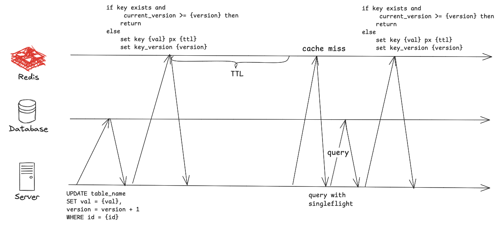

# 摘要

互联网后端开发的岗位面试中，“如何保证数据库和缓存的数据一致性”是非常高频的问题，网上存在两类主流方案，分别是1. 延迟双删；2. Changed Data Capture(CDC)方案。其中延迟双删方案几乎成为了该面试题的标准答案。本文通过分析延迟双删存在的问题，说明为什么不推荐使用延迟双删方案，并提出一种更简单的、基于乐观锁的替代方案。

# 延迟双删的问题

首先我们需要承认，不管用什么方案，数据库和缓存必然存在一定时间内的不一致，否则分布式共识算法就没有诞生的意义了。所以我们追求的是一种方案，能够尽可能减小数据库和缓存数据不一致的这个时间差，达成最终一致性。

延迟双删的精髓在于“双删”，即通过延迟的第二次删除缓存，以解决第一次删除缓存后其他的并发线程将旧数据写回了缓存从而导致的不一致问题。但是我们回过头来看，延迟双删方案为了解决数据库和缓存的不一致问题，引入了什么弊端。

1. 首先，第二次的删除导致服务必须再次从数据库中读取，这必然引发更多的读延迟；
2. 其次，延迟的时间如何抉择？对于不同的数据、业务的高峰期和低峰期，是否需要不同的延迟时间？这个时间是否需要动态调整和测试确定？
3. 然后还有如何实现延迟删除，是直接在内存中异步延迟，还是通过定时任务和消息队列来实现？

假设这几个问题，我们已经有了心理准备，并且也愿意花很重的成本引入消息队列或者定时任务来实现延迟。那么延迟双删是否就没有其他问题了呢？其实不是，那么我们看看下面的边界情况：


如果所示，四个线程分别进行自己的读或者写的逻辑，其中
1. thread 1首先将x设置成1，然后删除缓存；
2. 此时thread 2查询缓存没有命中，然后查数据库得到x=1，准备将x=1写回缓存，假设此时thread 2所在的进程因为网络抖动或者是长GC等原因，写回的操作稍微延后了一些；
3. 在thread 2查完数据库之后，thread 3将数据库中的x设置为了2，然后删除缓存；
4. 此时thread 3查询数据库得到x=2，然后非常顺利地将其写回了缓存，此时缓存中x=2；
5. thread 2苏醒，并继续将x=1设置到缓存，此时缓存中的x=1；
6. 如果延迟时间设置的足够好的话，thread 3的第二次删除，导致更新的x=2最终被写回了缓存，此时缓存和数据库实现了一致。

在我们构造的这个例子中，缓存中的x首先是被设置成了2，然后被设置成了1，最后再次被设置成了2，因此存在一些用户可能在先读到x=2之后又读到了x=1，很快又读到x=2。尽管最后我们将缓存更新成了正确的值，但是这种现象呈现的数据一致性也只能是在因果一致性之下了。不过好在大多数情况下，我们允许的并发更新之间本质上就没有所谓的因果关系，因此这样的现象，一些业务场景尚且可以接受，顶多影响用户的体验。

但是我们知道了，延迟双删可能存在这样的不一致问题，在一些业务中可能是不可以接受的。更坏的是，问题还没有结束。在我们的例子中，假设还有源源不断的并发的读写，而本质上读和写的这些缓存写回、缓存删除等操作的先后顺序在一定程度上可以随便排序，实际上在高并发的写和读的过程中，缓存和数据库也许大部分时间都是不一致的，只有等到写的流量稍微降下来之后，才能达到最终的一致性。这样看来，如果业务是持续有大量的并发写入，引入缓存的必要性就存疑。

# 问题的分析

为了实现延迟双删，我们需要引入异步逻辑，消息队列和定时任务的方案显得过于重，而即使是服务直接做内存中的延迟，也会使得系统变得极其复杂，难以追溯和排查。尽管如此，我们实现的系统依旧存在上述分析的不一致问问题。那么问题究竟在哪儿？

从我个人的思考来看，这其实不是一个技术问题，而是一个权衡取舍问题。首先，缓存的引入是为了应对读多写少的负载，大量的读请求可以享受缓存带来的高性能。前面也提到了，在不引入分布式共识算法（或更加复杂的分布式事务）的前提下，缓存一定存在和数据库不一致的时间区间，所以我们既想要缓存带来的高性能，有想要数据的一致性，本质上就是既要又要，这很难做到。而延迟双删本身的不优雅，其实也是一种设计不合理的暗示。

所以如果我们的业务场景就是写多读少的话，我们其实可以考虑去掉缓存，并将数据库从经典的MySQL换成写性能很强的数据库，比方说基于LSM-Tree的数据库系统，例如HBase等，甚至是半内存数据库，例如OceanBase等。当然，这通常意味着需要自运维或者花钱买服务，对于很多的业务来说是难以接受的。

换不了数据库，那有没有替代的方案呢？前面提到了CDC的方案，常见的就是用binlog的监听工具，这样就大大简化了缓存更新逻辑的设计，只需要消费binlog更新数据库即可。剩下需要考虑的就是延迟问题了，如果写入压力很大的话，binlog量也大，消费起来延迟可能会上到秒级，这也算是为了一致性做的一定的牺牲了。

其实还有一种常常被忽略的方案，就是基于乐观锁和用Lua脚本更新Redis的轻量级方案，下一节详细描述一下这个方案。

# 基于乐观锁的方案

这个方案很简单，我们引入一个单调递增的version属性，用于记录数据的更新版本，从而认为地将数据全序化（即使得任意的两个并发更新都可以比较先后顺序）。首先在MySQL的表结构中新增version字段，例如：

```sql
CREATE TABLE table_name(
  id BIGINT AUTO_INCREMENT,
  val VARCHAR NOT NULL DEFAULT '',
  version INT NOT NULL DEFUALT 0,
  PRIMARY KEY(id)
) 
```
这里省略了其他属性。

更新的流程简化如下：


如果所示，每次更新数据库中的数据的时候，我们将数据中的version自增1，实际上，我们可以将更新放在一个事务里，从而获取最新的版本值，例如
``` go
var version int32
Transaction(func () error {
  result, err := db.Exec("SELECT * FROM table_name WHERE id = ? FOR UPDATE", id)
  if err != nil {
    return err
  }
  version = result.Version + 1

  _, err := db.Exec("UPDATE table_name SET val = ?, version = version + 1 WHERE id = ?", id)
  if err != nil {
    return err
  }
})

// then update cache with version
```


Lua脚本如图中的伪代码所示，当key不存在或者当前key在缓存中的version小于参数中的version时，我们才更新缓存中的值和version，否则忽略更新缓存。当然，数据本身和version可以用不同的Redis key，通过hash tag使其在一个slot里，也可以仅用一个Redis key，采用hash结构存储value和version。

在这两个步骤之后，无论有多少的并发更新，写入Redis的永远是最新的数据。

其实，作为延迟双删的替代方案，到这里差不多就足够了。不过考虑到文章的完整性，我这里补充几个别的思考。

首先是异常处理，如果DB更新成功，但是Redis更新因为网络问题失败了会怎样？如果不是最高version的请求失败，则无关紧要，只要最高version的更新成功即可。如果是最高的version的请求失败了，并且在接下来的一段时间内都没有更新的update操作，则缓存会在TTL内不一致，等缓存过期后，新的读取请求将最新版本的数据写入Redis。因此，缓存的TTL不建议设置的过于大，防止长时间的数据不一致。

当然，我们可以增加一个步骤，那就是当获缓存数据的时候，同时将TTL拿到（设置时直接将TTL附在key上或者用pipeline获取），若距离TTL还有一段时间，例如还有2/3的TTL，我们可以随机性地发起一个请求去数据库里查询一次是否有更高version的数据，如果有，则异步更新写回缓存。当然，这个操作可以加分布式锁，使得全局只有一个请求访问数据库。当然在有足够并发更新的情况下，我个人认为这个优化不是很有必要。

此外，在很多讲述延迟双删的面经中没有提到的一点，缓存过期后，如何处理缓存击穿问题，这里我的方案是采用Golang中的singleflight方案（Java语言中可能也有现成的轮子，如果没有自己仿照Golang实现一个也不难），即同一台服务器上同一时间只允许一个数据库请求发出，其他的请求在内存中等待即可。

最后，我们既然用过了Redis，还可以将脚本直接存储在Redis中，通过sha来调用，减少每次parse脚本的性能损耗（如果愿意的话）。

# 总结

总体来说，基于乐观锁的方案，逻辑简单清晰，且无需考虑大量的边界case，是一个值得考虑的方案。我目前想到的不足是，可能需要建表之初就采用该方案，否则临时增加字段，可能需要更多的考虑。而延迟双删本质上是一个过于复杂且依然没有解决问题的方案，非常不优雅，除非有特别的原因一定要用，否则我个人是不推荐这种方案的。事实上，我还没有在工作中遇到哪个项目实际上用了该方案，它更像是一种仅存在于面试中的方案吧。
