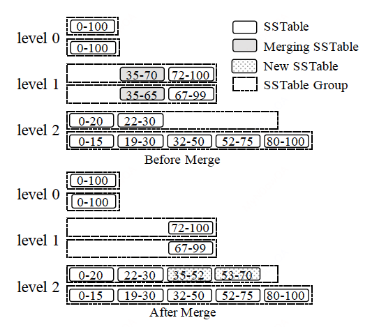

LSM-tree的原始论文为：《The log-structured merge-tree (LSM-tree)》。关于现代LSM-tree的机制我推荐阅读这篇综述论文：《LSM-based Storage Techniques: A Survey》，本文的核心内容取自这篇文章。

# 最简单的K/V store

## Log与顺序写入
考虑如下shell脚本：

```shell
#!/bin/bash

db_set() {
    echo "$1,$2" >> database
}

db_get() {
    grep "^$1," database | sed -e "s/^$1,//" | tail -n 1
}
```

使用方法：
```shell
$ source db.sh          # 首先load两个函数
$ db_set my_key hello   # set my_key = hello
$ db_get my_key
hello

$ db_set my_key world   # update my_key = world
$ db_get my_key
world

$ cat database          # 查看我们的database存储的是什么？
my_key,hello
my_key,world

```

以上，我们实现了一个最简单的单机版本的kv store。我们来看看我们究竟做了什么？
- 首先，我们实现了两个接口，db_set和db_get，分别用于将写入key和读取key。
- 对于db_set函数，我们将其追加到数据库文件database即可；
- 对于db_get函数，我们从文件中查找匹配我们制定的key的行并取其值，如果有多行命中，则取最后/最新的一个。

在这个数据库例子中，database即为一个log，db_set命令所做的事就是将key-value pair往里append，其写入时无需找到当前写入的key是否已经存在于log中，而是写入一条新的记录。只有在执行db_get时，我们才需要从日志中查找key的记录，并取最后一条作为当前key的最新值，因而db_get的时间复杂度为O(n)。对于删除数据，可以将其考虑为一次写入，只是写入的并非一个新的值，而是做一个标记，当读取时如果判断key的最新的记录是一个删除标记，我们便知道该key已经被删除

可见，当我们写入/更新/删除数据时，只需要一次顺序IO，这样db的写入性能得到了提升。

## SSTables

在我们实现的这个最简单的db中，读取性能需要从最后往前遍历整个log，当log过于大时，性能是极其差的。并且由于我们的log是append-only的，因此当我们的写入/更新/删除命令执行多了之后，log的大小会变的非常大，其中积累了很多的旧数据。
为此，我们需要做两件事来优化我们数据库的性能：

- *Log compaction*。当日志大小达到一定的阈值后，我们创建一个新的log来承接新的写入和更新，新的log我们姑且称其为active log，而对于旧的log，我们将其进行压缩整理，删除其中的旧数据，以此来减少旧数据所占用的磁盘空间。当我们要读取一个key时，首先从active log中尝试读取，如果没有，我们再尝试从旧的log中进行读取。
- *根据key将我们的kv pair进行排序*。排序之后，我们就可以为我们的log文件创建索引（index）：例如，我们记录一个log文件中存储的最小的key和最大的key（我们默认基于key的字典序来进行排序），这样，当我们读取某个key时，就可以避免读所有的log文件，而只需要读取key的范围囊括了我们要查找的key的log，从而优化了查询性能。我们将这样的排序后的log文件称为Sorted String Table，简称SSTable。

在第二点中，我们不断地产生新的log文件，旧的文件中的key时可能重叠的，为此我们还需要将其进行merge，如下图所示:


在有了以上的基础之后，我们就已经有了一个db最基础的实现了，尽管其性能离实际生产中的要求还差得很远。当然，对于一个数据库而言，仅仅能够读和写还是远远不够的，我们至少还需要考虑（1）故障恢复；和（2）并发控制。

尽管简陋，但是我们可以基于这个思想来逐步优化我们的db。而本文的主角，就是基于这样的思想发展出来的LSM技术。

# LSM技术简介

The Log-Structured Merge-Tree(LSM-tree)如今已经在NoSQL存储中被广泛使用，包括但不限于BigTable(谷歌的闭源数据库)、Dynamo（Amazon的闭源数据库）、HBase（Java开发的开源数据库）、Cassandra（同样用Java开源的NoSQL数据库）、LevelDB（谷歌的传奇工程师Jeff Dean等人开源的C++实现的内嵌kv存储引擎）、RocksDB（Facebook从LevelDB fork出来的开源内嵌kv存储引擎）等。其优点有：很高的写入性能、高空间利用率、简化了并发控制和故障恢复等。

## LSM-tree 基础

通常来说，索引结构有两种更新策略可选：（1）就地更新，例如B+树，原地用新值覆盖旧的值；（2）非就地更新，而是将新的值存到另一个地方，而不是直接覆盖旧值，例如LSM tree。如下图所示：


这里列出一个表格来简单对比两种策略：

|      | 就地更新                                                                          | 非就地更新                                                                     |
|------|-----------------------------------------------------------------------------------|--------------------------------------------------------------------------------|
| 优点 | 1. 读性能较高，因为最新的数据只存在一个地方；                                        | 1. 写入性能较高，因为其充分利用了顺序IO；<br> 2. 简化了故障恢复，因为其无需覆盖旧的值    |
| 缺点 | 1. 写性能较差，因为更新和写入需要随机IO；<br> 2. 页分裂可能导致磁盘碎片，降低磁盘的利用率。 | 1. 读性能较差，因为一个记录可能存在于多个位置；<br> 2. 通常需要单独的进程/线程来优化存储 |


利用顺序IO，异地更新数据的思想最早起源于1970年代，最早的日志log的存储也的确导致了很差的读取性能以及因为旧数据导致的低空间利用。1996年，LSM-trees发表，其提出merge操作来解决这些问题。

LSM-tree将存储设计为一连串的组件: $C_0, C_1,...,C_k$, 每个组件都是一个B+树，其中$C_0$在内存中，用于承接新的写入，剩余的组件在磁盘中。当$C_i$满了之后，将有滚动的merge进程/线程被触发，将$C_i$的一定范围的叶子结点merge到$C_{i+1}$中。后面我们会看到，原始的LSM-tree的这样的merge策略因为其实现的复杂度并没有被现代的众多实现所采用。LSM-tree的原始论文表明：在一个稳定的workload中，当level的数量为静态的时候，当level的size比率为$T_i = \frac{C_{i+1}}{C_i}$时，其写性能最优。


上图简单演示了原始的LSM-tree的核心设计。

## 现代LSM-trees

基于LSM技术的存储架构大致如下：


上图是对LevelDB的结构进行了简化的大致架构图。

### 基础数据结构

从上图中我们可以看见，存储组件氛围两大类，一类是内存中的memtable，一类是磁盘中的disk。

写请求的执行流程大致如下：
- 首先写请求经过Write-Ahead Log（简称WAL，该技术被广泛用于故障恢复系统，在我们熟悉的MySQL中其被称为redo-log），然后写入memtable；
- memtable达到一定的大小之后，产生新的memtable，而原来的memtable变成一个不可变的memtable，用于后续merge到磁盘中。
- 磁盘中的log在逻辑上被划分成多个level，每个level比其上一层level的大小大一定的倍数，例如10倍。当某个层level i满了之后，其部分/所有组件被merge到level i+1中。

读请求的执行过程大致如下：

- 首先从memtable中尝试读取，如果读到值则返回结果；
- 否则从level 0开始读取，如果读到值，返回结果，否则继续从level i+1读取，直到读到最后一层，如果最后一层也没有读到值，则说明该key不存在。

当磁盘中某一层的大小达到一个阈值，就将其merge到更大的一层中，merge的过程中，会将key的旧值删除，只保留新值（如果相邻的两层中都含有某个key的值，较小的level中的值更新，将会被保留；而较大的level中的值更旧，就会被舍弃）。

### Merge策略

下图展示了两种可选的merge policies，分别是(1) leveling merge policy，即原始的LSM-tree采用的merge策略，和（2）tiering merge policy。


两种merge策略都将磁盘中的组件逻辑上分成了不同的level，相邻的level的size比率为T，每个level被标记上其key的范围（回忆第一章介绍的SSTables）。

- 在leveling merge policy中，每个level中只有一个组件，$Level_{i+1}$的大小是$L_i$的T倍。$Level_{i+1}$会被$L_i$中的数据merge多次，直到填满。
- 在Tiering merge policy中，每个level中存在至多T个组件，当$Level_i$被填满后，其T个组件将被merge称为$Level_{i+1}$中的一个新的组件。

一般来说，Leveling merge policy对读性能更友好，而Tiering merge policy对写性能更加友好，我们将性能分析的小节中进一步分析。

### 常见的优化

基于LSM-tree的存储引擎中，一下的两种优化手段是非常著名，几乎所有的实现都会使用到。

#### Bloom filters

第一种手段是布隆过滤器。布隆过滤器是一种概率数据结构，其仅用很小的空间就可以对一个集合中的成员是否存在进行回答。当布隆过滤器回答一个key不存在时，这个key就真的不存在；当布隆过滤器回答一个key存在时，这个key可能存在，可能不存在，这个现象被称为false positive，false positive rate是可以配置的，通常false positive rate配置的越小，布隆过滤器所占用的空间就越大。尽管布隆过滤器存在较小的false positive，但其能够帮我们过滤相当大的读取请求。考虑到SSTable是不可变的，因此非常适合为每个SSTable都建立一个布隆过滤器。

> Bloom filters的大致原理是，采用一个bit vector来估计membership，其支持两种操作：1. 插入一个key；2. 查看一个key是否存在。当我们插入一个key时，首先分别用k个相互独立的hash函数对key计算hash，并将每个hash结果映射到某一个bit位，奖这些bit位的值设置成1。当我们查看一个key是否存在时，同样计算这个k个hash值，并查看其对应的bit位的，如果全为1，则返回存在；否则返回不存在。
> 
> 设我们一共采用k个hash函数，并且在这k个hash函数相互独立的情况下，布隆过滤器的false positive rate值为$$\left( 1 - e^{-kn/m} \right) ^ k$$，其中n表示key的个数，m表示bit vector的大小。通过简单的导数运算可以得出当$$k = \frac{m}{n}\mathrm{ln}2$$时，false positive rate取得极值。注意，实际情况中k个hash函数不太可能真正的完全独立，对于非独立的hash函数，布隆过滤器的false positive rate公式极其复杂，这里不展开说了（PS：我也不懂，超过我的数学知识范畴了）。
> 
> 布隆过滤器的一个缺点就是，当集合中的数据被删除时，布隆过滤器本身无法直接删除该元素，只能重建。好在在SSTable的场景，没有删除操作，而对于merge后的新SSTable，本身就需要重建。对于真的需要不重建而删除元素的“布隆过滤器”，可参考一下Quotient Filters，这里也不再展开。


#### Partitioning

Partitioning就是将磁盘上的组件按照key的range划分为（通常是等大的）多个小块。这样做有一些好处：
- 缩小了merge操作的时间以及创建新的SSTable所需的临时空间大小的上界；
- 对于一些workload尤其是连续的create，只需merge那些key的range有交集的SStables。

Partitioning可以结合merge策略一起实现，不过据了解，当前的工业实现中只对partitioned leveling merge policy进行了完整的实现。我们后面会看到为什么。

##### Partitioned leveling merge policy

对于leveling merge policy，每个磁盘组件都被划分为多个等大小的SSTables，当要将level L的SSTable merge到L + 1时，L + 1层中所有key range和L层有交集的SSTable都会被选中参与merge，产生新的SSTable放在L + 1.


如上图所示，L1中的0-30准备要merge到L2，此时L2中key range有重叠的0-15和16-32被选中参与merge，结果是L2新增了0-10和11-19两个SSTables，而旧的则被GC。

##### Partitioned tiering merge policy

对于tiering merge policy，因为每一层本身就存在多个SSTables的key range有重叠，所以不像leveling那样方便分割。有两种方法可以对每层的SSTables进行分组管理，分别是（1）垂直分组（vertical grouping）和（2）水平分组（horizontal grouping）。所谓分组，顾名思义就是将每层的SSTable划分出不同的分组。

对于垂直分组，我们将每层中的SSTables的key range有重叠的划分到一个分组，这样我们就可以将其看作是每层里的不同level，然后采用leveling merge policy的方式来处理。如下图所示：


在上图中，L1的0-31，0-30两个SSTables被放在了一个group，L2中key range有重叠的0-13、16-32所在的两个分组被选择参与merge，产生的两个新的SSTables 0-12和17-31被分别放在L2的两个分组里。

对于水平分组，因为每层本身就存在多个磁盘组件，因此每个磁盘组件本身就作为了一个group，每个group被按照key range划分成多个SSTables。每一层维护一个active gorup，也就是第一个group，用于承接上一层merge过来的数据。Merge操作选择该层的所有key range有重叠的gorup，然后将merge后的新SSTables放在active gorup。如下图所示：



### 并发控制和故障恢复

并发控制主流的方案就是（1）锁机制；（2）多版本控制。在本文4.2节会简要介绍LevelDB的版本控制。

而故障恢复主流的办法就是WAL，故障恢复时，通过重放log中的成功操作即可。此外，磁盘中的文件在compaction中也会变化，因此这些文件中active的那些也需要在故障恢复中被恢复，常见的手段是使用单独的log来记录这些文件的变化。

### 性能分析

下表展示了两种merge policy的性能定量估计，总体来说，tiering的写性能更好，但是读性能和空间利用的更差。

| Merge Policy | Write                             | Point Lookup (Zero-Result/Non-Zero-Result)       | Short Range Query   | Long Range Query              | Space Amplification        |
|--------------|-----------------------------------|--------------------------------------------------|---------------------|-------------------------------|----------------------------|
| Leveling     | $O\cdot \left(\frac{L}{B}\right)$ | ‌ $O ( L \cdot e^{− \frac{M}{N}} ) / O(1)$       | ‌ $O ( L )$         | ‌ $O ( \frac{s}{B} )$         | ‌ $O ( \frac{T + 1}{T} )‌$ |
| Tiering      | ‌ $O\left(\frac{L}{B}\right)$‌    | ‌ $O (T\cdot L \cdot e^{− \frac{M}{N}} ) / O(1)$ | ‌ $O ( T \cdot L )$ | ‌ $O ( T \cdot \frac{s}{B})$‌ | ‌$ O ( T )$                |


其中：
- L表示层数；
- T表示$sizeof(L_{i+1})/ sizeof(L_i)$;
- N表示entries数；
- B表示page大小；
- M表示布隆过滤器的bit数
- s表示一个range query访问的唯一key 的个数


# LSM-tree的优化

尽管LSM-tree这么流行，但是基础的LSM-tree依然存在各种缺点和不足。这一节将简单介绍针对LSM-tree存在的问题的优化方向，并重点介绍写放大的一些案例（工业界较为关注的问题）。

## 优化方向概览


上图展示了常见的一些问题点及其优化的方向。

- 写放大（write amplification）。常见的优化思路是采用tiering来组织每层的组件，此外还有merge skipping等方法。后面会详细介绍写放大问题的概念和优化手段。
- Merge操作。顾名思义，也就是在merge的流程上做文章，例如跳过一些层的merge等。
- 硬件设备。例如采用SSD来取代传统的HDD，以提升性能。
- 特殊的workloads。同样顾名思义，就是根据不同类型的workload做定制化的优化。
- 自动调优。
- 二级索引。

本文将重点关注的是写放大问题。

### 放大问题

放大问题分三种
- 读放大（有时也叫读负载, Read amplification, Read Overhead）；
- 写放大（有时也叫写负载, Write amplification, Write Overhead）；
- 空间放大（Space amplification、 Memory Overhead等）。

我们先给出几个定义，首先是我们真正存储在设备/存储系统中的用户数据，我们称之为基础数据（我自己瞎翻译的，原文base data）；为了方便我们的读取，我们额外存储的例如索引等数据，成为辅助数据（我自己瞎翻译的，原文auxiliary data）。

#### 读放大
我们读取的包括基础数据和辅助数据的数据总量 与 我们真实想要读的数据的比率。

举个例子，当我们要从MySQL中读数据，那么读放大指的就是遍历B+树以及base data的数据量 比上 base data的数据量。

#### 写放大
类似的，写放大就是我们需要更新/写入到设备上的实际的数据量 与 用户逻辑上需要写的数据量的比率。

同样以MySQL的例子，写放大就是我们写入一条数据，需更新的几个索引和数据本身的写入的比例。

#### 空间放大

简单来说就是我们引入的辅助数据带来的空间大小 加 实际需要存储的数据大小 与 base data的比率。例如MySQL的B+树索引带来的空间放大、LSM-tree的旧数据带来的空间放大等。

### RUM猜想

RUM猜想（原文是The RUM Conjecture， 取Read， Update， Memory首字母）是哈佛大学的[一篇论文](https://stratos.seas.harvard.edu/files/stratos/files/rum.pdf)的一个结论：一个访问方法，可以对read、update、memory overheads三者中的两者设置一个上界，同时给剩下的那个设置一个下界。换一个表述，也就是，Read，Update，Memory三者，我们只能针对其中至多两个来做优化，并且以第三者为代价。原文：

> An access method that can set an upper bound for two out the the read, update, and memory overheads, aslo set a lower bound for the third overhead.

另一种表述:
> Read, Update, Memory - Optimize Two at the Expense of the Third.

有点类似于CAP理论的表述，三者只得其中至多两个，不能既要又要。


上图展示了一些流行的技术/数据结构在RUM中的位置。

有了这个结论的指导，我们就可以看到，在设计数据库时，我们需要做怎样的取舍。例如，B+树取得了优秀的读性能，但是写吞吐不够，因为B+树的平衡需要在写/更新的时候来维护。

## 写放大优化：WiscKey

综述中提到的几个方向，但我个人的感觉是都不算有突破性的方案，并且也都引入了较大的实现复杂度和难以量化的性能问题。本文讲述的是一个较为有名的解决方案，即KV分离，我个人认为这个是比较级切合实际的方案。

2016年，美国威斯康星大学麦迪逊分校发表了一篇文章《[WiscKey: Separeting Keys from Values in SSD-Consicious Storage](https://www.usenix.org/system/files/conference/fast16/fast16-papers-lu.pdf)》，提出了WiscKey（名字来源于学校名, Wisconsin），即采用k/v分离的手段来优化LSM-tree的写放大和读放大。

### 观察

WiscKey文章对LevelDB的读写放大问题做了分析，下图展示了LevelDB的读写放大情况：


作者发现对于SSD，有以下结论：


对于SSD来说，顺序读的性能按照预期确实是最优的，此外，单线程随机读性能只有顺序读的一半，而并行随机读的性能在16KB后已经追上了顺序读，两者差距不大。该结论是WiscKey的一个重要依据。

LSM-trees的主要性能损耗就是在compaction，在compaction中，多个文件被读进内存中，排序后再写到磁盘上，这个过程也会对workload造成影响。注意到，排序过程仅仅需要key，而不需要value。而value和key被存在一起，value就需要被一同读到内存中，并且通常value的大小远大于key的大小。这对性能是有较大影响的。


### KV分离
在刚才的观察中，我们有以下几个结论：
- LevelDB的读写放大问题较为严重；
- SSD中并行随机读性能基本追平顺序读；
- Compaction场景只需要用key来进行排序，value是用不到的。

基于此，WiscKey的核心思想是：
- 将keys和values分离存储，只有keys存储在LSM-tree中，values则存储在单独的日志中（未排序）；
- 因为values被分离，导致读请求需要随机IO，WiscKey采用SSD的并行随机读特性来弥补（上一节的结论，并行随机读在SSD上性能追平顺序读）。


如上图所示，LSM-tree值存储了key，以及该key对应的value的地址；values则单独存储在另外的日志中。

通过kv分离，LSM-tree从数据量上直接缩小了很多，因此性能得到了很大优化。

### 流程
本节我们简要介绍WiscKey的读写相关流程。

写入:


如图所示，首先将value写入vlog，得到value在vlog中的offset和size，这样就能找到value；
将key和value的offset和size写入LSM-tree。


读取:

按照LSM-tree的读取流程定位到key；
再根据value的offset和value从vlog中获取value。


### 遇到的挑战

垃圾回收问题：

注意到，kv分离后，LSM的compaction只能删除无效的key，但是value是没有被删除的。因此需要额外的手段来从vlog中删除无效的value，这个手段就是GC。

具体怎么做呢？vlog中除了存储value，也存储key，如下图所示。此外维护两个指针，tail和head，新的值从head后面append，tail则是开始GC的指针，只有在tail和head中的值被认为是有效的值。


在GC过程中，WiscKey从tail读取一小块kv对，然后从LSM中query这些key是否还是有效的，如果有效，则从head后面再次append，并往后移动tail，将这小块kv对清除即可。当然，为了保证数据不丢失，还需要做一些别的手段来保证tail的持久化等。

### 实验数据

顺序load：


随机load：


随机load写放大：


随机查询性能：


范围查询性能：

 
空间放大：


## Merge过程的优化

本节简述一下国科大的文章《[Building an Efficient Put-Intensive Key-Value Store with Skip-Tree](https://ieeexplore.ieee.org/document/7569086)》。该文章提出了skip-tree，核心思路是，正常来说一条数据会从L0到L1，从L1到L2，……，从L5到L6。那如果能够知道某些中间层没有该key，那就可以直接跳过这些中间层，从而减少写放大。


当某个key可以从L直接被merge到L+K时，则直接将该key push到L+K层，从而减少了一层一层的merge。另外，L+K层有一个mutable buffer用来承接直接push过来的key，在后续的merge中会把buffer中的数据merge到L+K层。

这个方案引入了一个可变buffer的维护，其维护难度是不低的。综述中指出，尚不清晰这个方案和精调过的LSM相比优化了多少。

# 代表性案例

LSM-tree的第一个开源实现应该就是Google的LevelDB。LevelDB是谷歌传奇工程师Jeff Dean等人用C++实现的基础的LSM-tree，其代码因为简洁优雅，经常被用作C++工程代码的学习案例。不过LevelDB实现的功能较为简单，Facebook从LevelDB fork出了RocksDB，做了一些优化和更丰富的功能。

不过由于其基石地位，后面很多的论文和工业实现都用LevelDB做对比和分析，本文也用LevelDB来做学习一些实践。

## LevelDB的memtable

memtable实际上用什么数据结构实现都可以，不过大部分的选择其实都在平衡树和跳表中选择。LevelDB所用的数据结构是跳表（skip-list）。

跳表是在1990年的《[Skip lists: a probabilistic alternative to balanced trees](https://dl.acm.org/doi/10.1145/78973.78977)》这篇文章中提出来的一个概率数据结构，作为平衡树的一个替代品。其由于实现简单，理解简单，被广泛使用。例如Redis中用skip list来实现sorted set等。


上图演示了Skiplist的大致模样。skiplist是一个有序map，其由多层list构成，最底下的那层包含了完整的数据，而相对高一层的list则维护了较少的数据（少的量是概率性的）。当我们读取数据时，从某一层开始读取（论文有分析从$$L = \mathrm{log}_{1/p} n$$层开始是相对最优的），当searchKey大于当前节点时，则在该层向前移动一个节点，如果在某层无法继续，则往下移动一层，再次重复，如果是在最后一层，有数据则返回key的值，否则说明key不在skiplist中。可以看出，在较高的层中，因为跳过了某些节点，从而减少了比较的次数，加快了读取速度。当插入key时，首先按照search的方式，找到待插入的key在skiplist中的“垂直位置”，如上图中的那个“update环”，按照概率p来决定是否要往上再加一层，最终在该“垂直位置”将新的key插入skiplist中。

Skiplist平均的search、insert和delete时间复杂度为$$O(n)$$，同其他平衡树数据结构相同，不过其最差时间复杂度为$$O(n)$$(理论上的，一般不可能达到)。

Skiplist被选择作为memtable，可能更多的原因是其实现简单，并发控制实现简单。

## LevelDB的MVCC

一个正经的DB，肯定少不了并发控制。LevelDB采用的是MVCC机制来实现快照读。本节我们简述LevelDB中的MVCC机制原理。
考虑到磁盘上的SSTables是不可变的，理论上读取的时候不需要任何的并发保护措施，只需要保证当某个SSTable被至少一个客户端在读取的时候，该文件不被删除（考虑删除时机？compaction）即可，这一点采用引用计数即可实现。而内存中的memtable采用和一个mutex保护临界区即可，并采用sequence number来实现快照读。
基于这样的思路，LevelDB将磁盘中的SSTable的某个状态保存在一个version对象中， 当系统中存在多个version时，将这些version串成和一个双向链表，构成和一个version set，如下图所示：


其中version存储了一个快照，包含了各层level中各个SSTables的meta data，如下图所示：


其中每个FileMetaData包含了引用计数、文件号、文件大小、最大key和最小key（排序层面的最大和最小，用于决定该文件中key range）。每个version（其实主要是当前的version）维护了一个sequence number，当批量写入时，该seq number自增batch 的count数；当读取请求来的时候，该seq number作为读请求的seq number，在读取数据时，如果遇到了更大的序列号，则忽略该更新，这样实现了快照读。这点类似于MySQL innodb中的事务id。

当compaction后产生了新的SSTables，以及决定了应该GC掉的SSTables后，这些内容记录在一个version edit里，如下图所示


考虑到current version + version edit = new version，因此当new version生成之后，加入到version set即可：


注意version edit等信息也是需要持久化到磁盘中的manifest log中的。关于具体的维护时机和持久化以及Recover等细节，可参考LevelDB的源码。

# 实践应用

我们需要了解LSM技术和B+tree技术的优缺点，只有知己知彼，才能在合适的场景选择合适的技术。因此我们先来大概看下LSM和B+tree的性能表现。

##  性能对比
基于LSM的数据库一般都是各种分布式KV数据库，其中有的是自己基于LSM实现，有的是直接基于LevelDB或者RocskDB实现，比较著名的产品有

- Apache Cassandra（Facebook的Java实现的数据库）
- Google BigTable（Google的闭源数据库，经典论文）
- HBase（Java实现的BigTable的开源实现）
- TiKV（PingCAP用Rust实现的kv存储）
- InfluxDB（基于TSM-tree实现的时序数据库）等等。

我们已经从理论上分析了LSM-tree的特点就是写入/更新性能快，考虑到各种benchmark的条件各不相同，其实很难给出基于LSM-tree的读写性能和基于B+tree例如MySQL的绝对性能是多少。RocksDB的wiki中给出了自己的[benchmark](https://github.com/facebook/rocksdb/wiki/performance-benchmarks)，读者可以自行查看。不过这个没有和我们熟悉的MySQL的比较。我找了一篇[2016的blog](https://smalldatum.blogspot.com/2016/06/rocksdb-innodb-and-insert-benchmark.html)，其中只对比了插入性能：


当然这个结论也是符合我们预期的。

此外，我找到一篇2019的论文对HBase和MySQL各种workload都做了对比，使用的workload如下：

| Workload   | Operations                     |
|------------|--------------------------------|
| Workload A | 50% of reads and 50% of writes |
| Workload C | 100% read: read only           |
| Workload G | 100% update: update only       |

Workload A:


在读写参半的情况下，MySQL的读性能较好，而HBase的写性能则领先较多。

Workload C:


在偏向于读的workload下，MySQL更优，符合预期。

Workload G:


在倾向于写的workload下，HBase更胜一筹，符合预期。

此外，该文章还有在这三种workload下加大剂量的时候的对比，感兴趣的读者可自行查看。

## 业务类型

在有了上面的性能对比之后，我们大概就作出选择了。大概就是一下的几点考虑因素：
- 需要关系数据——选择B+tree，提供完整的ACID事务，读性能更优；
- 不需要关系数据，天然支持分布式，这种大多数时候都是选择KV，而基本上KV都是基于LSM或其改进。
- 强调写性能，选择LSM。

那么，具体来说，有哪些场景是非要选择NoSQL的呢？

**群聊系统的消息**

对于这类应用，首先不需要ACID，其次不需要关系数据，再者消息量大，最好是有天然的分布式，因此对于这类应用，首选肯定是例如Cassandra、HBase这样的NoSQL。

这里举一个例子，海外的Discord应用的技术选型就是MongoDB -> Cassandra -> ScyllaDB(Cassandra的C++实现)。详情可见Discord的这两篇文章：

- [HOW DISCORD STORES BILLIONS OF MESSAGES](https://discord.com/blog/how-discord-stores-billions-of-messages)
- [HOW DISCORD STORES TRILLIONS OF MESSAGES](https://discord.com/blog/how-discord-stores-trillions-of-messages)

类似的，对于近几年很火的直播应用的弹幕系统（可以理解为实时评论），许多公司也是选择用HBase。

需要注意的是，并非使用了LSM技术就解决了这些场景的所有问题。即便LSM写入性能高，很多应用也是在前面放了一层MQ削峰，而非拿LSM硬刚。此外，这些场景下还有其他复杂问题，例如读扩散、写扩散、分页、延时等等问题，这些也是值得探讨。


# 总结

本文从这篇综述[LSM-based storage techniques: a survey](https://dl.acm.org/doi/10.1007/s00778-019-00555-y)出发，简要介绍了LSM-tree的基本结构、常见的优化手段、RUM猜想以及写放大的优化案例WiscKey；简要介绍了LevelDB的memtable数据结构以及其版本控制原理。

事实上，在KV领域还有很多有趣的问题值得研究，例如分布式的实现、事务的支持，时序的实现等等。由于篇幅原因和本人水平有限，本文仅仅是抛砖引玉，希望能够给大家带来一点启发和帮助，文中难免有纰漏和不足，欢迎大家指出。

# References

- [LSM-based storage techniques: a survey](https://dl.acm.org/doi/10.1007/s00778-019-00555-y)
- [Designing Access Methods: The RUM Conjecture](https://stratos.seas.harvard.edu/files/stratos/files/rum.pdf)
- [WiscKey: Separating Keys from Values in SSD-Conscious Storage](https://pages.cs.wisc.edu/~ll/papers/wisckey.pdf)
- [leveldb](https://github.com/google/leveldb)
- [rocksdb](https://github.com/facebook/rocksdb/)
- [skiplist paper](https://15721.courses.cs.cmu.edu/spring2018/papers/08-oltpindexes1/pugh-skiplists-cacm1990.pdf)
- [Relational Databases Versus HBase: An Experimental Evaluation](https://www.semanticscholar.org/paper/Relational-Databases-Versus-HBase%3A-An-Experimental-Bousalem-Guabassi/c4c312eb6983c4d399413b65c2e097bcb7c7cd9b)

